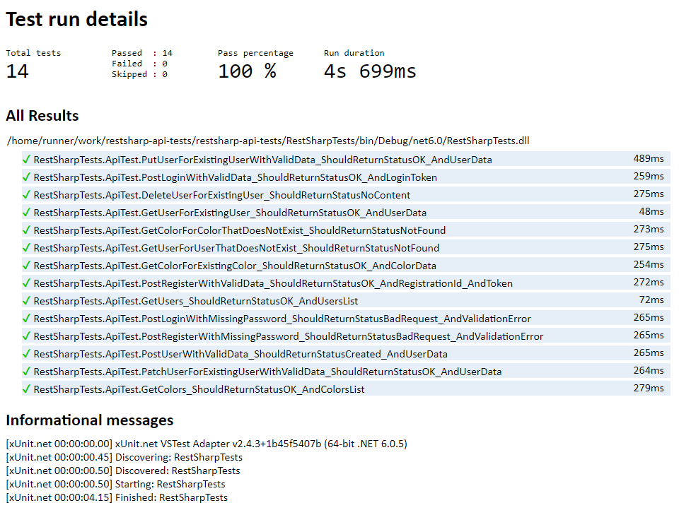

# RestSharp API Tests

A sample API test automation project in [C# on .NET](https://dotnet.microsoft.com/en-us/languages/csharp), using [xUnit](https://xunit.net/), [RestSharp](https://restsharp.dev/), and [Fluent Assertions](https://fluentassertions.com/).

## ReqRes

The API chosen for testing was ReqRes. It simulates how a real application behaves, is highly available and accessible from anywhere. For more information, visit their website [here](https://reqres.in/).

## How it works

The project uses xUnit as the test framework, Fluent Assertions as the assertion library, and RestSharp as the HTTP client to perform API requests.  
A workflow is set up to install .NET, run the tests, and publish the HTML report to GitHub Pages. The report can be viewed [here](https://kafziel4.github.io/restsharp-api-tests/).

## How to run it

- Install [.NET](https://dotnet.microsoft.com/en-us/download/dotnet/8.0)
- Run the tests and generate the report: `dotnet test -l "html;LogFileName=index.html"`

